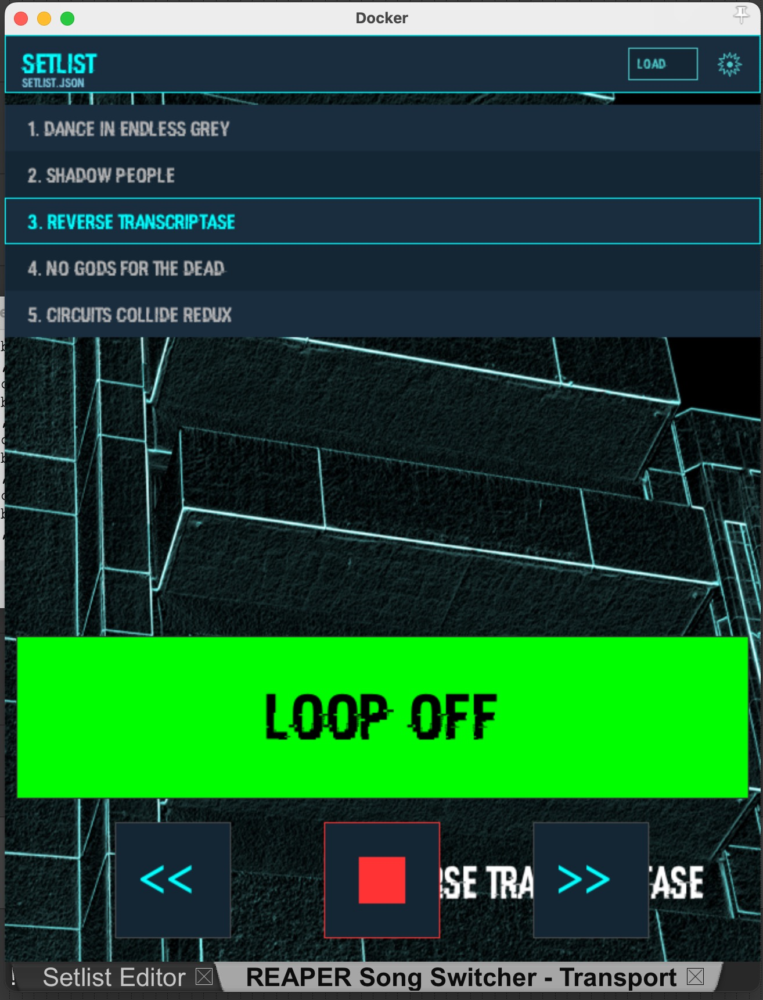
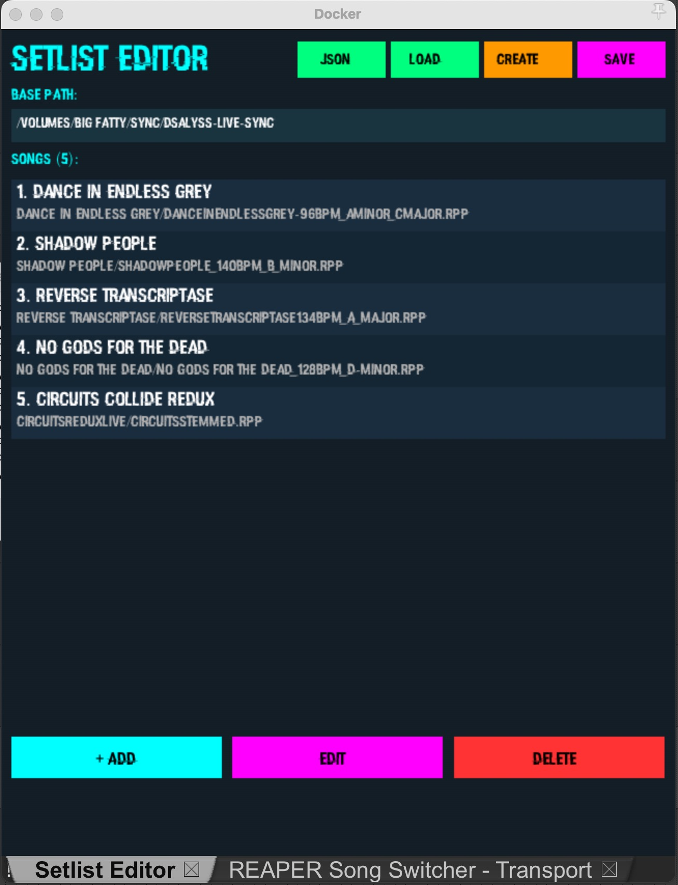

# Reaper Song Switcher

Lua scripts for Reaper that automatically switch between project files during live performances.

## What It Does

Automatically switches between project files during live performances by detecting when each song reaches its **End marker**, then loading and playing the next song in the setlist. Manual transport controls (play, stop, skip) let you override or navigate as needed.

## Architecture

Modular Lua design with clear separation of concerns:

### Transport System (switcher_transport.lua)
- 9 focused modules for auto-switching and UI
- Handles playback control and setlist management
- Modular transport with state, config, UI, input, and playback modules
- Configurable background image support with PNG rendering

### Setlist Editor (setlist_editor.lua)
- 7 focused modules for UI and file management
- Simplified main script (138 lines) coordinating specialized modules
- **editor_state.lua** - Centralized state initialization
- **editor_io.lua** - File I/O operations (load/save/config)
- **editor_songs.lua** - Song CRUD operations
- **editor_ui_utils.lua** - UI graphics and helper functions
- **editor_draw.lua** - Main UI rendering (buttons, song list, dirty indicator)
- **editor_dialogs.lua** - Modal dialogs (edit song, create setlist, load setlist)
- **editor_json.lua** - JSON viewer and editor modal

```
switcher_transport.lua - Main entry point + loop/UI control
├── modules/state.lua
├── modules/config.lua
├── modules/fonts.lua
├── modules/image_loader.lua
├── modules/ui.lua
├── modules/ui_components.lua
├── modules/input.lua
├── modules/playback.lua
├── modules/setlist.lua
└── modules/utils.lua

setlist_editor.lua - Setlist editor coordinator
├── modules/editor_state.lua
├── modules/editor_io.lua
├── modules/editor_songs.lua
├── modules/editor_ui_utils.lua
├── modules/editor_draw.lua
├── modules/editor_dialogs.lua
└── modules/editor_json.lua
```

## Scripts Included

### Main Scripts

#### `switcher_transport.lua` (Main UI - Recommended)

Full-featured transport control interface with:

- **Setlist display** - Shows all songs in the queue with current/selected highlighting
- **Transport controls** - Back (<<), Play/Stop, Skip (>>)
- **Loop toggle** - Large button to control intro/main section playback
  - 🟡 Yellow when **LOOP ON** - Plays the intro loop continuously (ambient sound between songs)
  - 🟢 Green pulsing when **LOOP OFF** - Plays the full song from intro through to end, pulses in sync with tempo!
- **File clicking** - Click any song in the list to select it, then press Play
- **Manual navigation** - Use << and >> buttons to jump songs
- **Font picker** - Gear icon in header to customize UI font and size
- **Background image** - Configure custom PNG background image (gear icon, Background tab)
- **Auto-switch detection** - Watches for End markers and switches songs automatically



#### `switcher.lua` (Headless Auto-Switch)

Background auto-switch script without UI:

- Pure auto-switching based on loop detection
- No visual feedback
- Use if you prefer minimal overhead or keyboard control

#### `setlist_editor.lua` (Setlist Editor)

Full gfx-based UI editor for managing your setlist:

- Add/edit/delete songs
- Drag to reorder songs with mouse
- **Load Setlist** button - Open existing .json setlist files
- **Create Setlist** button - Create new setlist with custom path
- **JSON Editor** button - View and edit raw JSON content (In Development)
- File picker for easy path selection
- Automatic backup on save (`setlist.json.bak`)
- Modular architecture (7 focused modules for better maintainability)



## Setup

### Prerequisites

- Reaper 6.20+
- Git (optional, for cloning the repository)

### Option 1: Easy Install (Recommended)

**macOS:**
```bash
bash install.sh
```

**Linux:**
```bash
bash install.sh
```

**Windows (PowerShell):**
```powershell
# PowerShell as Administrator
bash install.sh
```

Or using Command Prompt:
```cmd
bash install.sh
```

This installs all scripts and modules to Reaper's Scripts folder.

### Option 2: Manual Setup

**macOS:**
```bash
cp -r * ~/Library/Application\ Support/REAPER/Scripts/ReaperSongSwitcher/
```

**Linux:**
```bash
cp -r * ~/.config/REAPER/Scripts/ReaperSongSwitcher/
```

**Windows (PowerShell):**
```powershell
Copy-Item -Recurse -Force ./* "$env:APPDATA\REAPER\Scripts\ReaperSongSwitcher\"
```

Or using Command Prompt:
```cmd
xcopy /E /I /Y * "%APPDATA%\REAPER\Scripts\ReaperSongSwitcher\"
```

**Directory structure after installation:**

```
ReaperSongSwitcher/
├── switcher_transport.lua (main script)
├── switcher.lua
├── setlist_editor.lua
├── config.json
├── setlist.json
└── modules/
    ├── state.lua
    ├── config.lua
    ├── fonts.lua
    ├── image_loader.lua
    ├── ui.lua
    ├── ui_components.lua
    ├── input.lua
    ├── playback.lua
    ├── setlist.lua
    ├── utils.lua
    ├── editor_state.lua
    ├── editor_io.lua
    ├── editor_songs.lua
    ├── editor_ui_utils.lua
    ├── editor_draw.lua
    ├── editor_dialogs.lua
    └── editor_json.lua
```

**Configure `config.json` (font and background settings):**

```json
{
  "font": {
    "name": "Arial",
    "size": 16
  },
  "background_image": "/path/to/background.png"
}
```

**Configure `setlist.json`:**

```json
{
  "base_path": "/full/path/to/your/songs",
  "songs": [
    {"name": "Song 1", "path": "song1.rpp"},
    {"name": "Song 2", "path": "song2.rpp"},
    {"name": "Song 3", "path": "song3.rpp"}
  ]
}
```

## Running

### Transport UI (Recommended for Live)

`Scripts > ReaperSongSwitcher > switcher_transport.lua`

Shows a clean transport interface with the big LOOP button and song list.

### Auto-Switch Only

`Scripts > ReaperSongSwitcher > switcher.lua`

Runs silently in the background, no UI.

### Edit Setlist

`Scripts > ReaperSongSwitcher > setlist_editor.lua`

Open to add/edit/reorder songs in your setlist.

## How It Works

**End Marker Detection:**

- Looks for a marker named `"End"` in each project - this marks the exact switch point
- When playback reaches or passes this marker, the script automatically stops and loads the next song
- Also detects if playback stops near the End marker (within 2 seconds) to catch Reaper's auto-stop before the exact marker position
- Waits one frame for the next project to load, then starts playing

**Background Image Rendering:**

- PNG images loaded via `gfx.loadimg()` into buffer index 25
- Dimensions retrieved with `gfx.getimgdim()` and rendered with `gfx.blit()`
- Blits at full destination size (stretches/shrinks to fit transport window)
- Persisted in `config.json` under `background_image` field
- Selected via file browser in gear icon config menu (Background tab)

**Module Responsibilities:**

- **state.lua** - Initializes all global state variables with safe defaults
- **config.lua** - Loads/saves font and background_image configuration from JSON
- **fonts.lua** - Detects and manages system fonts
- **image_loader.lua** - PNG loading and rendering wrapper using gfx API
- **ui.lua** - Renders font picker, background image selector, and multi-tab config UI
- **ui_components.lua** - Draws main UI (header, buttons, song list, loop toggle, transport controls)
- **input.lua** - Handles keyboard and mouse input
- **playback.lua** - Manages song loading and auto-switch detection with End marker logic
- **setlist.lua** - Parses and manages setlist JSON files
- **utils.lua** - Provides logging and UI helper functions

**Important:** Each song project MUST have an `"End"` marker. Without it, that song won't auto-switch and you'll need to manually skip.

## Features

✅ **Automatic song switching** at loop points  
✅ **Manual transport controls** (play, stop, skip, back)  
✅ **Loop toggle** with tempo-synced visual feedback  
✅ **Visual setlist** with current song highlighting  
✅ **Configurable background image** (PNG format)  
✅ **File picker** for easy path selection  
✅ **Backup on save** (setlist.json.bak)  
✅ **Keyboard support** in editor (backspace, tab, enter, escape)  
✅ **Drag to reorder** songs in setlist  

## Requirements

- Reaper 6.20+
- `setlist.json` in script folder with correct `base_path`
- **Each song project MUST have an `"End"` marker** to trigger auto-switching

## Troubleshooting

**Songs not switching?**

- Verify each song has an `"End"` marker at the exact switch point
- Check that `setlist.json` has correct `base_path` and song paths (.rpp files exist)
- Ensure LOOP is OFF (green button) to play full songs through to the End marker

**Background image not displaying?**

- Verify PNG file exists at the configured path in `config.json`
- Try a different PNG file (some formats may not be supported)
- Image dimensions are automatically scaled to fit the transport window

**UI looks weird?**

- Reload the script with F5 (or re-run from Scripts menu)
- Check Reaper's dock settings - gfx window should appear as a floating panel

